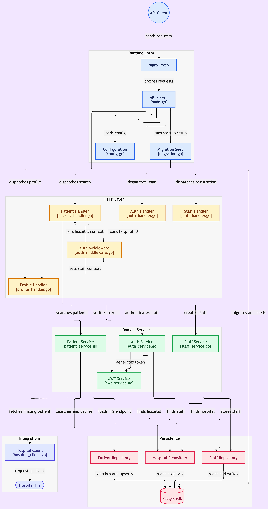

# Hospital Middleware Backend

This project is a backend middleware service for connecting hospital systems with a central API.

The application is developed with Go, Gin, PostgreSQL, GORM, Docker Compose, and Nginx.

Main features include:

* Staff registration
* Staff login with JWT authentication
* Patient search
* Hospital-level access control
* Integration with an external Hospital Information System (HIS)
* Unit tests for important business logic

Each staff account belongs to a hospital. After login, the hospital ID is stored in the JWT token and is used to limit patient searches to the same hospital.

When a patient cannot be found in the local database by national ID or passport ID, the middleware can request patient information from the hospital HIS and save the result in the local database.

## Tech Stack

Technology                  Usage                                                
-------------------------   ---------------------------------------------------- 
Go                          Main back-end programming language                   
Gin                         HTTP routing and API handling                        
PostgreSQL                  Main database for staff, hospital, and patient data  
GORM                        Database access and ORM for PostgreSQL               
JWT                         Staff authentication and hospital access information 
bcrypt                      Password hashing                                     
Nginx                       Reverse proxy in front of the Go API                 
Docker Compose              Runs Nginx, Go API, and PostgreSQL together          
Go `testing` / `httptest`   Unit testing and HTTP client testing 

## Architecture Diagram

The diagram below provides an overview of the middleware, its internal layers,
and its integration with PostgreSQL and the external Hospital Information System
(HIS).

<p align="center">
  <a href="./diagram.png">
    
  </a>
</p>

<p align="center"><sub>Click the diagram to view it at full size.</sub></p>

## Project Structure

```text
.
├── cmd/
│   └── server/
│       └── main.go
│
├── internal/
│   ├── client/
│   │   ├── errors.go
│   │   ├── hospital_client.go
│   │   └── hospital_client_test.go
│   │
│   ├── config/
│   │   └── config.go
│   │
│   ├── database/
│   │   └── database.go
│   │
│   ├── dto/
│   │   ├── hospital.go
│   │   ├── patient.go
│   │   └── staff.go
│   │
│   ├── handler/
│   │   ├── auth_handler.go
│   │   ├── patient_handler.go
│   │   ├── profile_handler.go
│   │   └── staff_handler.go
│   │
│   ├── middleware/
│   │   ├── auth_middleware.go
│   │   ├── auth_middleware_test.go
│   │   └── context.go
│   │
│   ├── migration/
│   │   ├── migration.go
│   │   └── seed.go
│   │
│   ├── model/
│   │   ├── hospital.go
│   │   ├── patient.go
│   │   └── staff.go
│   │
│   ├── repository/
│   │   ├── hospital_repository.go
│   │   ├── patient_repository.go
│   │   └── staff_repository.go
│   │
│   ├── service/
│   │   ├── auth_service.go
│   │   ├── auth_service_test.go
│   │   ├── errors.go
│   │   ├── jwt_service.go
│   │   ├── jwt_service_test.go
│   │   ├── patient_service.go
│   │   ├── patient_service_test.go
│   │   ├── staff_service.go
│   │   └── staff_service_test.go
│   │
│   └── testutil/
│       └── mocks.go
│
├── nginx/
│   └── default.conf
│
├── .dockerignore
├── .env.example
├── .gitignore
├── docker-compose.yml
├── Dockerfile
├── go.mod
├── go.sum
└── Makefile
```

The project is separated into small packages based on their responsibilities.

* `cmd/server` is the application entry point and initializes the server.
* `config` loads application configuration from environment variables.
* `database` creates and manages the PostgreSQL database connection.
* `migration` handles database migration and initial seed data.
* `model` contains database models used by GORM.
* `dto` contains request and response structures used by the API.
* `handler` handles HTTP requests and responses.
* `middleware` handles authentication and shared request context.
* `service` contains the main business logic of the application.
* `repository` handles database operations.
* `client` handles communication with the external Hospital Information System (HIS).
* `testutil` contains shared mocks and helpers used by tests.

The general request flow is:

HTTP Request
   | 
   v 
Handler
   | 
   v 
Service
   | 
   v 
Repository
   | 
   v 
PostgreSQL


For patient searches that require data from an external hospital system:

Patient Service
   | 
   v 
Hospital Client
   | 
   v 
External HIS

## Environment Variables

The application uses environment variables for configuration.

Create a `.env` file from `.env.example`:

```bash
cp .env.example .env
```

Example configuration:

```env
APP_PORT=8080

DB_HOST=localhost
DB_PORT=5432
DB_USER=postgres
DB_PASSWORD=your_password
DB_NAME=agnos
DB_SSLMODE=disable

JWT_SECRET=your_jwt_secret

HOSPITAL_A_API_URL=https://hospital-a.api.co.th
```

### Configuration

 Variable              Description                                    Example                        
 --------------------  ---------------------------------------------  ------------------------------
 `APP_PORT`            Port used by the Go API server                 `8080`                        
 `DB_HOST`             PostgreSQL host                                `localhost`                   
 `DB_PORT`             PostgreSQL port                                `5432`                        
 `DB_USER`             PostgreSQL username                            `postgres`                    
 `DB_PASSWORD`         PostgreSQL password                            `your_password`               
 `DB_NAME`             PostgreSQL database name                       `agnos`                       
 `DB_SSLMODE`          PostgreSQL SSL mode                            `disable`                     
 `JWT_SECRET`          Secret key used for signing JWT access tokens  `your_jwt_secret`             
 `HOSPITAL_A_API_URL`  Base URL of Hospital A HIS API                 `https://hospital-a.api.co.th` 

> Do not commit the real `.env` file to Git.
> Only `.env.example` should be included in the repository.

### Local Development

When running the application directly on your machine, PostgreSQL can be accessed through:

```env
DB_HOST=localhost
```

The application reads the configuration from the `.env` file when it starts.

### Docker Compose

When running with Docker Compose, the API connects to PostgreSQL using the Docker service name:

```env
DB_HOST=postgres
```

Docker Compose provides the required environment variables to the API container automatically.

The API runs internally on port `8080`, while Nginx exposes the application through:

```text
http://localhost:8080
```

The request flow is:

```text
Client
  |
  v
localhost:8080
  |
  v
Nginx
  |
  v
Go API :8080
  |
  v
PostgreSQL / Hospital HIS API
```
## Setup and Run

### Requirements

Make sure the following tools are installed:

* Docker
* Docker Compose

### Environment Variables

Create a `.env` file in the project root.

Example:

```env
APP_PORT=8080

DB_HOST=postgres
DB_PORT=5432
DB_USER=postgres
DB_PASSWORD=postgres
DB_NAME=agnos
DB_SSLMODE=disable

JWT_SECRET=your-secret-key

HOSPITAL_A_API_URL=http://hospital-a.example.com
```

When running with Docker Compose, `DB_HOST` should be `postgres` because the API connects to PostgreSQL using the Docker service name.

### Run with Docker

Build and start all services:

```bash
docker compose up --build -d
```

Check running containers:

```bash
docker compose ps
```

The API can be accessed through Nginx at:

```text
http://localhost:8080
```

Check the health endpoint:

```bash
curl http://localhost:8080/health
```

To view API logs:

```bash
docker compose logs -f api
```

To stop all services:

```bash
docker compose down
```

To stop all services and remove the PostgreSQL data volume:

```bash
docker compose down -v
```

### Application Startup

When the API starts, it will:

1. Load configuration from environment variables.
2. Connect to PostgreSQL.
3. Run database migration using GORM `AutoMigrate`.
4. Seed the initial hospital data if it does not already exist.
5. Start the HTTP server.

The Docker request flow is:

```text
Client
  |
  v
localhost:8080
  |
  v
Nginx
  |
  v
Go API :8080
  |
  +----> PostgreSQL
  |
  +----> Hospital HIS API
```
## API Endpoints

Base URL:

```text
http://localhost:8080
```

### Health Check

```http
GET /health
```

Used to check if the API is running.

Example response:

```json
{
  "status": "ok",
  "message": "Agnos backend is running"
}
```

---

### Create Staff

```http
POST /staff/create
```

Create a new staff account for a hospital.

Authentication is not required for this endpoint.

Request body:

```json
{
  "username": "staff01",
  "password": "password123",
  "hospital": "hospital-a"
}
```

Example response:

```json
{
  "message": "staff created successfully",
  "data": {
    "id": 1,
    "username": "staff01",
    "hospital": "hospital-a"
  }
}
```

Possible status codes:

* `201 Created` - Staff created successfully
* `400 Bad Request` - Invalid request body
* `404 Not Found` - Hospital not found
* `409 Conflict` - Staff already exists

---

### Staff Login

```http
POST /staff/login
```

Login with staff credentials and receive a JWT access token.

Request body:

```json
{
  "username": "staff01",
  "password": "password123",
  "hospital": "hospital-a"
}
```

Example response:

```json
{
  "access_token": "<jwt-token>",
  "token_type": "Bearer"
}
```

Possible status codes:

* `200 OK` - Login successful
* `400 Bad Request` - Invalid request body
* `401 Unauthorized` - Invalid username, password, or hospital

---

### Search Patient

```http
GET /patient/search
```

Search patient information.

This endpoint requires a JWT access token.

Header:

```http
Authorization: Bearer <jwt-token>
```

Supported query parameters:

| Parameter       | Description                          |
| --------------- | ------------------------------------ |
| `national_id`   | Thai national ID                     |
| `passport_id`   | Passport ID                          |
| `first_name`    | First name                           |
| `middle_name`   | Middle name                          |
| `last_name`     | Last name                            |
| `date_of_birth` | Date of birth in `YYYY-MM-DD` format |
| `phone_number`  | Phone number                         |
| `email`         | Email address                        |

Example:

```http
GET /patient/search?first_name=John&last_name=Doe
```

Example response:

```json
{
  "count": 1,
  "data": [
    {
      "id": 1,
      "patient_hn": "HN001",
      "national_id": "1234567890123",
      "passport_id": "",
      "first_name_th": "",
      "middle_name_th": "",
      "last_name_th": "",
      "first_name_en": "John",
      "middle_name_en": "",
      "last_name_en": "Doe",
      "date_of_birth": "1990-01-01",
      "phone_number": "0812345678",
      "email": "john@example.com",
      "gender": "M"
    }
  ]
}
```

The hospital is not received from the query parameter. The API uses `hospital_id` from the JWT token to make sure staff can only search patients from their own hospital.

If the patient is not found in the local database, the service will try to search from the hospital HIS API.

The hospital is not received from the query parameter. The API uses `hospital_id` from the JWT token so that staff can only search for patients from their own hospital.

## External HIS Behavior

Patient searches use the local database first.

For searches by national ID or passport ID, if the patient is not found locally, the service can request the patient from the HIS API of the staff's hospital.

The flow is:

```text
Search local database
        |
        v
 Patient found?
    |        |
   Yes       No
    |        |
    v        v
 Return    Search HIS
             |
             v
         Patient found?
           |       |
          Yes      No
           |       |
           v       v
       Save local  Return no result
           |
           v
       Return patient
```

A patient returned by the HIS is saved in the local database so that later searches can use the local record.

The hospital used for the HIS request is determined from the authenticated staff account. The client cannot choose another hospital through the patient search request.

## Design Decisions

### Why use `hospital_code` instead of `hospital_id`?

Staff registration uses `hospital_code` instead of accepting the database `hospital_id` directly.

`hospital_id` is an internal database identifier. A client should not need to know the internal ID of a hospital before creating a staff account.

The API accepts a hospital code such as:

```text
hospital-a
```

and resolves it to the hospital record internally:

```text
hospital_code
      |
      v
Find hospital
      |
      v
hospital_id
      |
      v
Create staff
```

This keeps the database ID internal while still allowing the client to identify which hospital the staff belongs to.

### Hospital Access Control

After a successful login, the staff's `hospital_id` is included in the JWT access token.

Protected endpoints use the authenticated hospital information instead of accepting a hospital ID from the client.

For example, patient search does not accept:

```text
?hospital_id=1
```

The hospital is taken from the JWT token instead. This prevents staff from selecting another hospital simply by changing a request parameter.

## Testing

Run all tests with:

```bash
go test ./...
```

The tests cover important parts of the application, including:

- Staff service logic
- Authentication logic
- JWT handling
- Authentication middleware
- Patient service logic
- Hospital HIS client behavior


